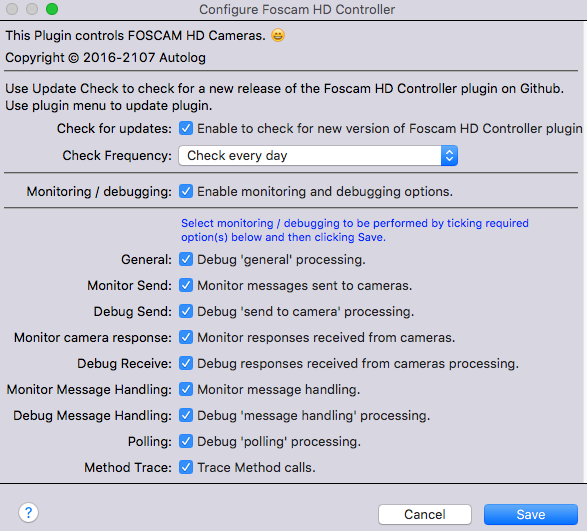
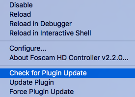
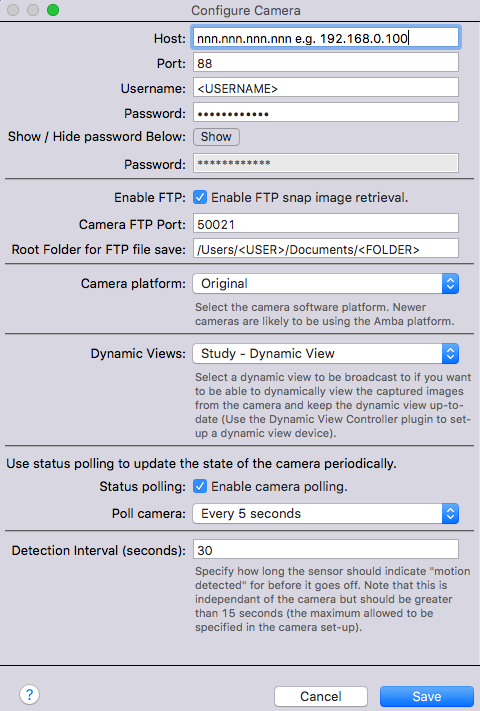

# Foscam HD Controller

## Introduction
The Foscam HD Controller is a plugin for the Indigo (version 7+) home automation system (http://indigodomo.com) that facilitates the downloading of snapped images as a result of motion being detected by a Foscam HD camera.

It works in conjunction with the Dynamic View Controller to allow the downloaded images to be displayed in a Control Page.

It is **strongly recommended** to read this documentation to familiarise yourself with the way of working.

## Installation
### Prerequisites
The essential installation pre-requisite is that you have some Foscam HD cameras for the plugin to control.

### Installation
Download and install the plugin as normal for Indigo plugins.

### Plugin Configuration

When the plugin starts for the first time, the Configuration dialogue will be displayed. This dialogue is also available via the main Indigo menu *Plugins > Foscam HD Controller > Configure...*.

The plugin configuration dialogue has a number of options:

* **Update Check**
    Use Update Check to check for a new release of the Foscam HD Controller plugin on Github. Use plugin menu (see later) to update plugin.
    Check tick box to enable checks for updates and select frequency (daily or weekly).

* **Monitoring / debugging**
    These options are to support monitoring and debugging. All logging is now done to Indigo 7 standards and to a separate file that can be accessed by clicking on the Show Events Logs Folder button in the Indigo Event Log window. The log file is *plugin.log* in the *com.autologplugin.indigoplugin.foscamhdcontroller* folder. This folder also contains date stamped logs from the previous five days.
    Logging is not normally required but can be useful for fault finding and debugging.

### Plugin Menu

The plugin menu, in addition to the standard items, has additional items for update checking:

* **Check for Plugin Update**

    Select this item to perform an immediate check for a plugin update

* **Update Plugin**

    Select this item to perform a plugin update. The update will only proceed if there is a newer version available.

* **Force Plugin**

    Select this item to force a plugin update. The update will effectively refresh the current version if there isn't a newer one available or update to a newer one if there is.

### Device Configuration

Each Foscam HD camera is defined as an indigo device via New... > Type: Foscam HD Controller > Camera

The configuration options are:

* **Host**

    Camera IP Address e.g. 192.168.0.100

* **Port**

    Camera port e.g 88

* **Username**

    Username used to access camera
* **Password**

    Password used to access the camera. **Note the password is stored in the clear in Indigo DB.**
    Click Show to view password

* **Enable FTP**

    If you want to download the images from camera enable this

* **Camera FTP Port**

    Typically 50021

* **Root Folder for FTP file save**

    Location where you want the camera images stored on your Mac.
    Note : No trailing slash '/'

* **Camera platform**

    Select the camera software platform. Newer cameras are likely to be using the *Amba* platform.

* **Dynamic Views**

    Select a Dynamic View from the pulldown list. This will be empty if you haven't yet setup a dynamic view, you will have to come back and update this once you have setup a dynamic view.

* **Status Polling**

    Tick to enable polling. This is required if you want to detect motion

* **Poll camera**

    Select interval from pull-down list e.g. Every 5 seconds

* **Detection Interval**

    The interval to show motion detected for when motion detection is tripped. If the camera detects further motion during this period then the detection interval starts again from zero.

## Usage

### Start Up

The UI Status of Indigo Foscam HD Camera devices will initially be shown as 'No Ack' (No Acknowledgement). Once a status update has been received, the standard *off* or *no motion sensor* symbols will be shown as appropriate.

### Indigo UI Home Window Device Info

The relevant Device info listed in the Window is as follows:

* **State**

    Shows Foscam HD camera state: if motion detection hasn't been enabled then a grey dot icon with a state of *off* will be shown. If motion detection has been enabled then a grey motion sensor icon will be shown  with a state of *no motion* if no motion is detected else it will show green motion sensor icon with a state of *tripped*. It can also be a red dot with 'No Ack' (No Acknowledgement) indicating communication has been lost with the camera.

* **Device Name**

    The name of the Foscam HD Camera.

* **Address**

    The IP address of the physical Foscam HD Camera.

* **Notes**
    User defined.

* **Folder**

    User defined.

* **Model**

    The camera model e.g: 'FI9826P+V2'

* **Protocol**

    Foscam HD Controller :)

* **Firmware**

    Shows the Foscam HD Camera firmware.

### Built-In Indigo Controls

The plugin is implemented as an Indigo Sensor Device, so the built-in Indigo controls can be be used to control the Foscam HD Camera motion detection:

The various built-in controls are described below:

* **Turn Off**

    Will turn off the motion detection for the camera. No motion will be detected.

* **Turn ON**

    Will turn on the motion detection for the camera. Motion will be detected.

### Actions

* **Get Motion Alarm Status**

    Updates the camera motion detection state Not normally needed if polling set to a short interval.

* **Enable Motion Alarm**

    Turn camera motion alarm on. The state will show no motion if no motion detected or triggered if motion detected. The motion icons are displayed alongside the state in the Device list.

* **Disable Motion Alarm**

    Turns off camera motion detection. State is shown as off with a grey dot shown for the icon.

* **Toggle Motion Alarm**

    Toggles on / off state of camera motion detection

* **Ring Tone On**

    Turns camera ring tone on - camera will emit an alarm when motion detected - can be useful for testing.

* **Ring Tone Off**

    Turns camera ring tone on - camera will not emit an alarm when motion detected - this would probably be the normal state?

* **Ring Tone Toggle**

    Toggles on / off state of camera ring tone

* **Snap Picture On**

    Turns on camera picture snapping when motion detected - must be on for ftp image retrieval.

* **Snap Picture Off**

    Turns off camera picture snapping when motion detected - disables ftp image retrieval.

* **Snap Picture Toggle**

    Toggles on / off state of camera image snapping

* **Update Camera Status**

    Updates the status of the camera. Not normally needed if polling set to a short interval.

### States
The plugin provides the following states:

*To Be Advised*

### Scripting

The LIFX plugin's ID is 'com.autologplugin.indigoplugin.foscamhdcontroller'.

*Scripting example to follow*

